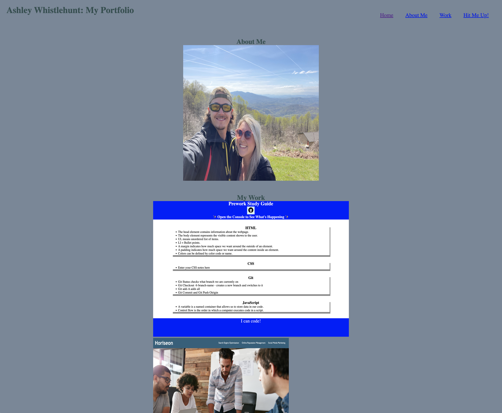
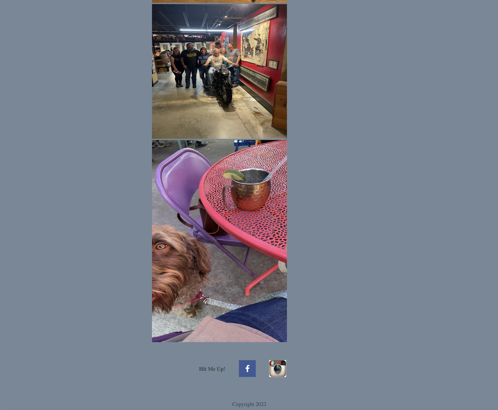

# my-portfolio

[Link to my project](https://alandis01.github.io/MyPortfolio/)

## table-of-contents
- [Description of Project](#description-of-project)
- [Visuals](#visuals)

## description-of-project
Worked from scratch to create HTML and CSS text displaying my portfolio. Created navigation links on the page as well as images that lead to their cooresponding application. I used flex box to wrap and align images as well as text on the page. Created a working, functional portfolio. 

## visuals

